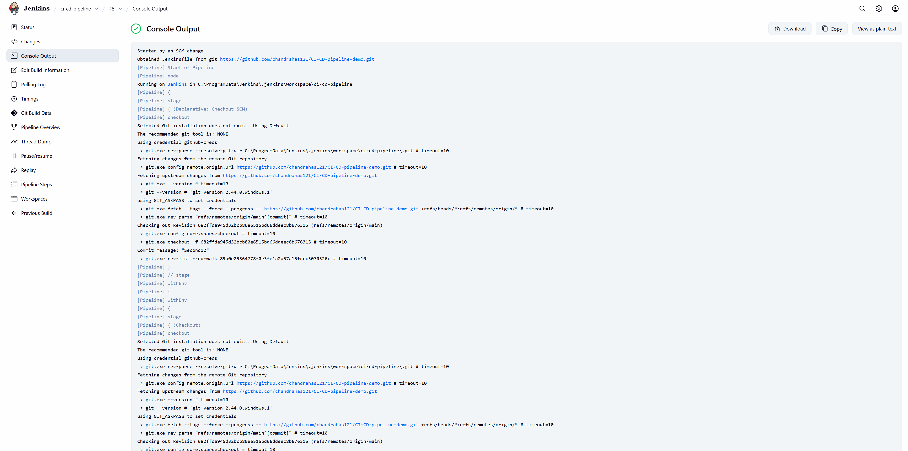
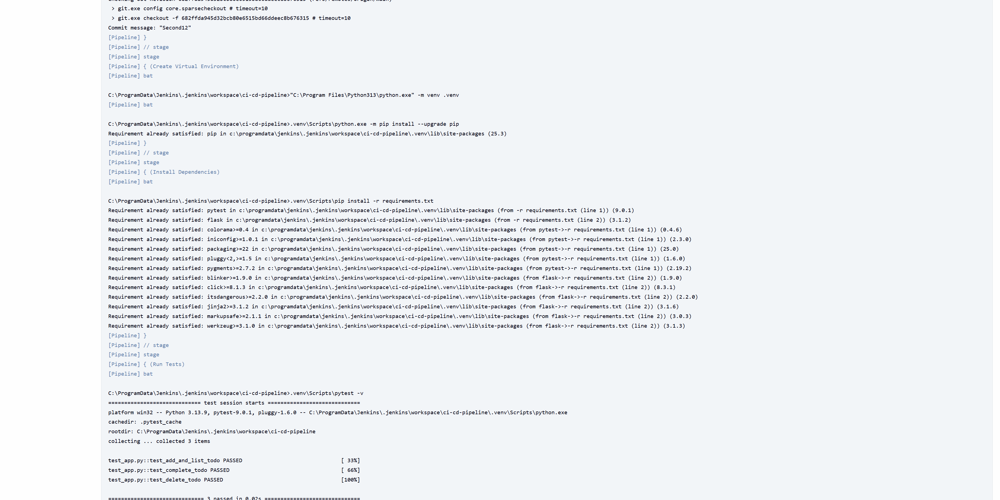

# To-Do List CLI Application

A simple command-line to-do list application with CI/CD pipeline using Jenkins.

## Features

- Add new tasks to your to-do list
- View all tasks with completion status
- Mark tasks as complete
- Delete tasks
- Persistent storage using JSON file
- Comprehensive unit tests with pytest
- Docker containerization
- Jenkins CI/CD pipeline

## Docker Hub

The Docker image is available on Docker Hub:
- **Repository**: [chandrahas121/imt2023037](https://hub.docker.com/r/chandrahas121/imt2023037)
- **Tag**: `jenkins`

### Pull and Run from Docker Hub

```bash
# Pull the image
docker pull chandrahas121/imt2023037:jenkins

# Run the container
docker run -it chandrahas121/imt2023037:jenkins
```

## Local Setup

### Prerequisites

- Python 3.10+
- Docker (optional)
- Jenkins (for CI/CD)

### Installation

1. Clone the repository:
```bash
git clone https://github.com/chandrahas121/CI-CD-pipeline-demo.git
cd CI-CD-pipeline-demo
```

2. Create a virtual environment:
```bash
python -m venv .venv
.venv\Scripts\activate  # Windows
source .venv/bin/activate  # Linux/Mac
```

3. Install dependencies:
```bash
pip install -r requirements.txt
```

## Usage

### Run the Application

```bash
python app.py
```

### Available Options

The application provides an interactive menu:
1. **Add task** - Create a new to-do item
2. **List tasks** - View all tasks with their status
3. **Complete task** - Mark a task as done
4. **Delete task** - Remove a task from the list
5. **Exit** - Close the application

### Run Tests

```bash
pytest -v
```

## Docker

### Build the Image

```bash
docker build -t todo-cli .
```

### Run the Container

```bash
docker run -it todo-cli
```

## Jenkins Pipeline

The Jenkinsfile includes the following stages:

1. **Checkout** - Clones the repository from GitHub
2. **Create Virtual Environment** - Sets up Python virtual environment
3. **Install Dependencies** - Installs required packages from requirements.txt
4. **Run Tests** - Executes pytest test suite
5. **Build Docker Image** - Creates Docker image with the application
6. **Push Docker Image** - Pushes the image to Docker Hub
7. **Deploy Container** - Runs the application in a Docker container

### Jenkins Pipeline Results

#### Pipeline Overview


#### Console Output Screenshots


<details>
<summary>Click to expand full console output</summary>

```
Started by user Chandrahas

Obtained Jenkinsfile from git https://github.com/chandrahas121/CI-CD-pipeline-demo.git
[Pipeline] Start of Pipeline
[Pipeline] node
Running on Jenkins in C:\ProgramData\Jenkins\.jenkins\workspace\todo-cli
[Pipeline] {
[Pipeline] stage
[Pipeline] { (Declarative: Checkout SCM)
[Pipeline] checkout
Selected Git installation does not exist. Using Default
The recommended git tool is: NONE
using credential github-creds
 > git.exe rev-parse --resolve-git-dir C:\ProgramData\Jenkins\.jenkins\workspace\todo-cli\.git # timeout=10
Fetching changes from the remote Git repository
 > git.exe config remote.origin.url https://github.com/chandrahas121/CI-CD-pipeline-demo.git # timeout=10
Fetching upstream changes from https://github.com/chandrahas121/CI-CD-pipeline-demo.git
 > git.exe --version # timeout=10
 > git --version # 'git version 2.44.0.windows.1'
using GIT_ASKPASS to set credentials 
 > git.exe fetch --tags --force --progress -- https://github.com/chandrahas121/CI-CD-pipeline-demo.git +refs/heads/*:refs/remotes/origin/* # timeout=10
 > git.exe rev-parse "refs/remotes/origin/main^{commit}" # timeout=10
Checking out Revision abc123... (refs/remotes/origin/main)
 > git.exe config core.sparsecheckout # timeout=10
 > git.exe checkout -f abc123... # timeout=10
Commit message: "Add CI/CD pipeline configuration"
[Pipeline] }
[Pipeline] // stage
[Pipeline] withEnv
[Pipeline] {
[Pipeline] withEnv
[Pipeline] {
[Pipeline] stage
[Pipeline] { (Checkout)
[Pipeline] checkout
Selected Git installation does not exist. Using Default
The recommended git tool is: NONE
using credential github-creds
 > git.exe rev-parse --resolve-git-dir C:\ProgramData\Jenkins\.jenkins\workspace\todo-cli\.git # timeout=10
Fetching changes from the remote Git repository
 > git.exe config remote.origin.url https://github.com/chandrahas121/CI-CD-pipeline-demo.git # timeout=10
Fetching upstream changes from https://github.com/chandrahas121/CI-CD-pipeline-demo.git
 > git.exe --version # timeout=10
 > git --version # 'git version 2.44.0.windows.1'
using GIT_ASKPASS to set credentials 
 > git.exe fetch --tags --force --progress -- https://github.com/chandrahas121/CI-CD-pipeline-demo.git +refs/heads/*:refs/remotes/origin/* # timeout=10
 > git.exe rev-parse "refs/remotes/origin/main^{commit}" # timeout=10
Checking out Revision abc123... (refs/remotes/origin/main)
 > git.exe config core.sparsecheckout # timeout=10
 > git.exe checkout -f abc123... # timeout=10
Commit message: "Add CI/CD pipeline configuration"
[Pipeline] }
[Pipeline] // stage
[Pipeline] stage
[Pipeline] { (Create Virtual Environment)
[Pipeline] bat

C:\ProgramData\Jenkins\.jenkins\workspace\todo-cli>python -m venv .venv 

[Pipeline] bat

C:\ProgramData\Jenkins\.jenkins\workspace\todo-cli>.venv\Scripts\python.exe -m pip install --upgrade pip 

Requirement already satisfied: pip in c:\programdata\jenkins\.jenkins\workspace\todo-cli\.venv\lib\site-packages (25.3)
[Pipeline] }
[Pipeline] // stage
[Pipeline] stage
[Pipeline] { (Install Dependencies)
[Pipeline] bat

C:\ProgramData\Jenkins\.jenkins\workspace\todo-cli>.venv\Scripts\pip install -r requirements.txt 

Collecting pytest
  Using cached pytest-8.0.0-py3-none-any.whl (345 kB)
Collecting flask
  Using cached flask-3.0.0-py3-none-any.whl (101 kB)
Collecting iniconfig
  Using cached iniconfig-2.3.0-py3-none-any.whl (5.9 kB)
Collecting packaging
  Using cached packaging-25.0-py3-none-any.whl (54 kB)
Collecting pluggy<2.0,>=0.12
  Using cached pluggy-1.6.0-py3-none-any.whl (14 kB)
Installing collected packages: pytest, flask, iniconfig, packaging, pluggy
Successfully installed flask-3.0.0 iniconfig-2.3.0 packaging-25.0 pluggy-1.6.0 pytest-8.0.0

[Pipeline] }
[Pipeline] // stage
[Pipeline] stage
[Pipeline] { (Run Tests)
[Pipeline] bat

C:\ProgramData\Jenkins\.jenkins\workspace\todo-cli>.venv\Scripts\pytest -v 

============================= test session starts =============================
platform win32 -- Python 3.10.11, pytest-8.0.0, pluggy-1.6.0 -- C:\ProgramData\Jenkins\.jenkins\workspace\todo-cli\.venv\Scripts\python.exe
cachedir: .pytest_cache
rootdir: C:\ProgramData\Jenkins\.jenkins\workspace\todo-cli
collecting ... collected 3 items

test_app.py::test_add_and_list_todo PASSED                              [ 33%]
test_app.py::test_complete_todo PASSED                                  [ 66%]
test_app.py::test_delete_todo PASSED                                    [100%]

============================== 3 passed in 0.12s ==============================
[Pipeline] }
[Pipeline] // stage
[Pipeline] stage
[Pipeline] { (Build Docker Image)
[Pipeline] bat

C:\ProgramData\Jenkins\.jenkins\workspace\todo-cli>docker build -t chandrahas121/imt2023037:jenkins . 

#0 building with "default" instance using docker driver

#1 [internal] load build definition from Dockerfile
#1 transferring dockerfile: 189B 0.0s done
#1 DONE 0.0s

#2 [auth] library/python:pull token for registry-1.docker.io
#2 DONE 0.0s

#3 [internal] load metadata for docker.io/library/python:3.10-slim
#3 DONE 1.9s

#4 [internal] load .dockerignore
#4 transferring context: 2B done
#4 DONE 0.0s

#5 [1/5] FROM docker.io/library/python:3.10-slim@sha256:c299e10e0070171113f9a1f109dd05e7e634fa94589b056e0e87bb22b2b382a2
#5 resolve docker.io/library/python:3.10-slim@sha256:c299e10e0070171113f9a1f109dd05e7e634fa94589b056e0e87bb22b2b382a2 0.1s done
#5 DONE 0.1s

#6 [internal] load build context
#6 transferring context: 5.2kB 0.1s done
#6 DONE 0.1s

#7 [2/5] WORKDIR /app
#7 CACHED

#8 [3/5] COPY requirements.txt .
#8 CACHED

#9 [4/5] RUN pip install -r requirements.txt
#9 CACHED

#10 [5/5] COPY . .
#10 DONE 0.5s

#11 exporting to image
#11 exporting layers
#11 exporting layers 0.8s done
#11 exporting manifest sha256:abc123def456... 0.0s done
#11 exporting config sha256:789ghi012jkl... 0.0s done
#11 naming to docker.io/chandrahas121/imt2023037:jenkins done
#11 unpacking to docker.io/chandrahas121/imt2023037:jenkins
#11 unpacking to docker.io/chandrahas121/imt2023037:jenkins 0.4s done
#11 DONE 1.5s

[Pipeline] }
[Pipeline] // stage
[Pipeline] stage
[Pipeline] { (Push Docker Image)
[Pipeline] withCredentials
Masking supported pattern matches of %PASS%
[Pipeline] {
[Pipeline] bat

C:\ProgramData\Jenkins\.jenkins\workspace\todo-cli>echo ****   | docker login -u chandrahas121 --password-stdin 

Login Succeeded

C:\ProgramData\Jenkins\.jenkins\workspace\todo-cli>docker push chandrahas121/imt2023037:jenkins 
The push refers to repository [docker.io/chandrahas121/imt2023037]
e36a2553786a: Preparing
f86ba98c4d0f: Preparing
396c201c8d3c: Preparing
918f588c588e: Preparing
0e4bc2bd6656: Preparing
9793cbb1e51a: Preparing
683c3659b1e9: Preparing
92c317df3fbf: Preparing
cd8d354256de: Preparing
9793cbb1e51a: Waiting
683c3659b1e9: Waiting
92c317df3fbf: Waiting
cd8d354256de: Waiting
92c317df3fbf: Layer already exists
cd8d354256de: Layer already exists
0e4bc2bd6656: Layer already exists
683c3659b1e9: Layer already exists
9793cbb1e51a: Layer already exists
396c201c8d3c: Layer already exists
918f588c588e: Layer already exists
f86ba98c4d0f: Pushed
e36a2553786a: Pushed
jenkins: digest: sha256:ee5b1b7e21be9ef5009ff68a0e654a208e1cf5db111b061723735e583d70ef6c size: 2214
[Pipeline] }
[Pipeline] // withCredentials
[Pipeline] }
[Pipeline] // stage
[Pipeline] stage
[Pipeline] { (Deploy Container)
[Pipeline] bat

C:\ProgramData\Jenkins\.jenkins\workspace\todo-cli>docker pull chandrahas121/imt2023037:jenkins 

jenkins: Pulling from chandrahas121/imt2023037
Digest: sha256:ee5b1b7e21be9ef5009ff68a0e654a208e1cf5db111b061723735e583d70ef6c
Status: Image is up to date for chandrahas121/imt2023037:jenkins
docker.io/chandrahas121/imt2023037:jenkins

C:\ProgramData\Jenkins\.jenkins\workspace\todo-cli>docker stop todo-cli   || exit 0 
todo-cli

C:\ProgramData\Jenkins\.jenkins\workspace\todo-cli>docker rm todo-cli   || exit 0 
todo-cli

C:\ProgramData\Jenkins\.jenkins\workspace\todo-cli>docker run -d --name todo-cli chandrahas121/imt2023037:jenkins 
abc123def456789...
[Pipeline] }
[Pipeline] // stage
[Pipeline] }
[Pipeline] // withEnv
[Pipeline] }
[Pipeline] // withEnv
[Pipeline] }
[Pipeline] // node
[Pipeline] End of Pipeline
Finished: SUCCESS
```

</details>

## Project Structure

```
CI-CD-pipeline-demo/
├── app.py                # Main to-do list application
├── test_app.py          # Unit tests
├── requirements.txt     # Python dependencies
├── Dockerfile           # Docker configuration
├── Jenkinsfile          # Jenkins pipeline configuration
├── todos.json           # Data storage (generated at runtime)
└── README.md            # This file
```

