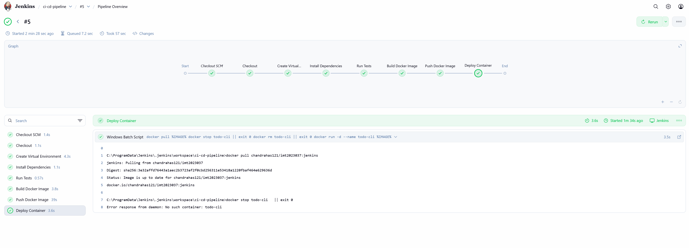
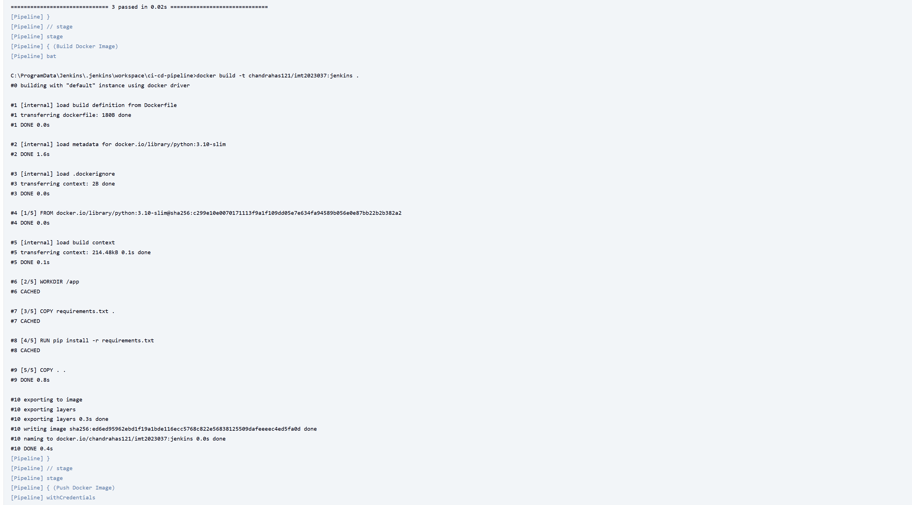
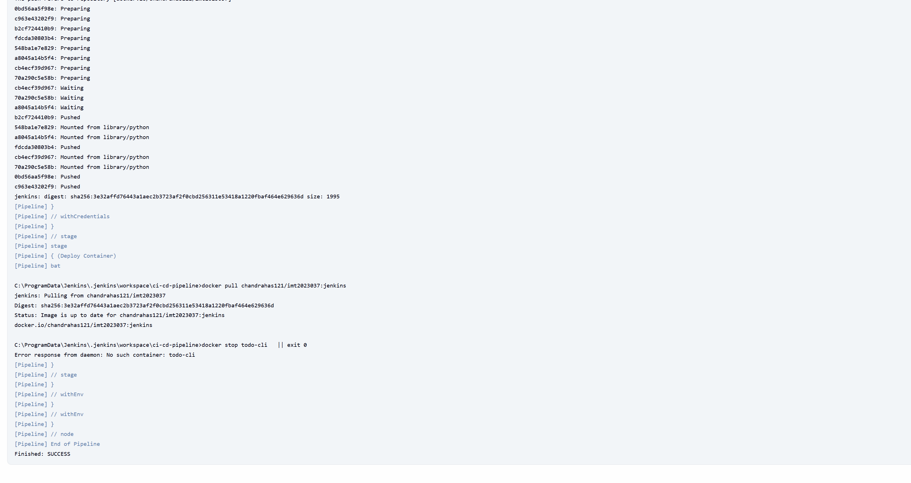

# To-Do List CLI Application

A simple command-line to-do list application with CI/CD pipeline using Jenkins.

## Features

- Add new tasks to your to-do list
- View all tasks with completion status
- Mark tasks as complete
- Delete tasks
- Persistent storage using JSON file
- Comprehensive unit tests with pytest
- Docker containerization
- Jenkins CI/CD pipeline

## Docker Hub

The Docker image is available on Docker Hub:
- **Repository**: [chandrahas121/imt2023037](https://hub.docker.com/r/chandrahas121/imt2023037)
- **Tag**: `jenkins`

### Pull and Run from Docker Hub

```bash
# Pull the image
docker pull chandrahas121/imt2023037:jenkins

# Run the container
docker run -it chandrahas121/imt2023037:jenkins
```

## Local Setup

### Prerequisites

- Python 3.10+
- Docker (optional)
- Jenkins (for CI/CD)

### Installation

1. Clone the repository:
```bash
git clone https://github.com/chandrahas121/CI-CD-pipeline-demo.git
cd CI-CD-pipeline-demo
```

2. Create a virtual environment:
```bash
python -m venv .venv
.venv\Scripts\activate  # Windows
source .venv/bin/activate  # Linux/Mac
```

3. Install dependencies:
```bash
pip install -r requirements.txt
```

## Usage

### Run the Application

```bash
python app.py
```

### Available Options

The application provides an interactive menu:
1. **Add task** - Create a new to-do item
2. **List tasks** - View all tasks with their status
3. **Complete task** - Mark a task as done
4. **Delete task** - Remove a task from the list
5. **Exit** - Close the application

### Run Tests

```bash
pytest -v
```

## Docker

### Build the Image

```bash
docker build -t todo-cli .
```

### Run the Container

```bash
docker run -it todo-cli
```

## Jenkins Pipeline

The Jenkinsfile includes the following stages:

1. **Checkout** - Clones the repository from GitHub
2. **Create Virtual Environment** - Sets up Python virtual environment
3. **Install Dependencies** - Installs required packages from requirements.txt
4. **Run Tests** - Executes pytest test suite
5. **Build Docker Image** - Creates Docker image with the application
6. **Push Docker Image** - Pushes the image to Docker Hub
7. **Deploy Container** - Runs the application in a Docker container

### Jenkins Pipeline Results

#### Pipeline Overview


#### Console Output Screenshots






## Project Structure

```
CI-CD-pipeline-demo/
├── app.py                # Main to-do list application
├── test_app.py          # Unit tests
├── requirements.txt     # Python dependencies
├── Dockerfile           # Docker configuration
├── Jenkinsfile          # Jenkins pipeline configuration
├── todos.json           # Data storage (generated at runtime)
└── README.md            # This file
```

